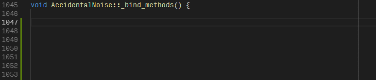

# Visual Studio Code Godot Snippets

### Snippets for Godot development.

Supported languages:
* C++:

    

## Installation

Currently there's no easy way to install snippets. For manual installation refer to:
* [Create your own snippets](https://code.visualstudio.com/docs/editor/userdefinedsnippets#_create-your-own-snippets)

> To create or edit your own snippets, select User Snippets under File > Preferences (Code > Preferences on macOS)

TODO: make this an actual extension or make contribution to [godot-tools](https://github.com/GodotExplorer/godot-tools/).

## Usage
1. Type `godot` prefix.
2. Press <kbd>Ctrl+Space</kbd> to popup intellisense for godot specific snippets.
3. Select snippet. Use <kbd>Tab</kbd> to jump between snippet's placeholders.

## Contributing

New snippets are added and modified per language in `snippets/src`, then run:
```bash
python make_snippets.py
```
The resulting snippets are going to be in `snippets` folder.

For easy snippet creation, you can use this handy tool: https://snippet-generator.app/
